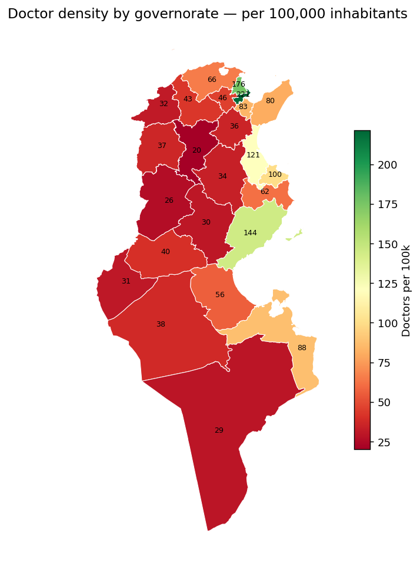
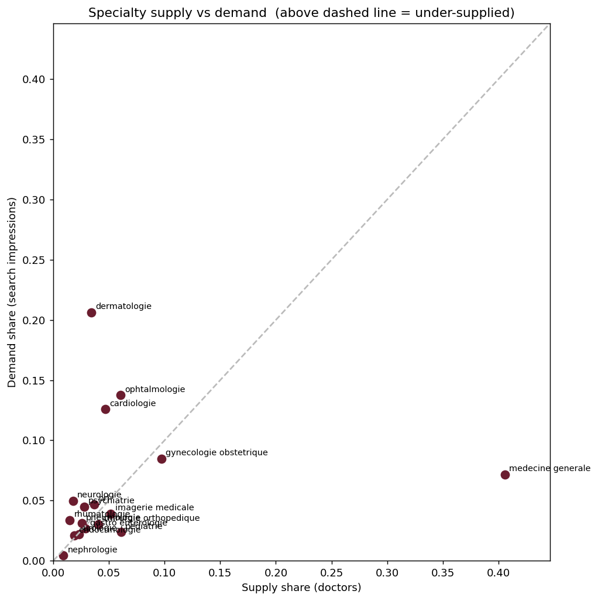

# Tunisia Medical Access — Supply vs Demand

> A data-science portfolio project: mapping **private healthcare access
> inequality** in Tunisia by joining the *supply* of private-practice doctors
> against the public *search demand* for them.

Most "find a doctor" analyses stop at counting doctors. The interesting
question is the **gap**:

> **Where is search demand for a specialty high, but doctor supply low?**

That gap — demand the local supply can't meet — is a data-driven definition of
a *medical desert*, and it's the headline of this project.

> **What "supply" means here.** Every doctor in this dataset is in **private
> practice** — listed at their own *cabinet*. Doctors who work only in public
> hospitals are **not** included. So this measures access to *private* care: the
> gaps partly reflect where private practice is economically viable (it tends to
> follow wealth and population density), not the total absence of medical care —
> a poorer interior governorate may have a public hospital but few private
> cabinets.

## First result — supply is coast-heavy



**Private-cabinet** doctors per 100,000 inhabitants (supply ÷ INS 2014 census
population). An **~11× gap**: Tunis (221) and Ariana (176) tower over Siliana (20)
and Kasserine (26); the national average is ~90. The coastal skew is partly a
*private-practice* skew — see the framing note above. See
`notebooks/02_density_and_map.ipynb` —
interactive version at `reports/figures/density_map.html`.

## Flagship result — the supply–demand gap



Overlaying search **demand** (Google Search Console) on doctor **supply** surfaces
the mismatch. **Dermatology** pulls ~21% of specialty search demand from just ~3%
of doctors — the most over-demanded specialty (≈3.7 search impressions per
dermatologist), followed by neurology, cardiology and ophthalmology.
**Généralistes** sit far below the line — 40% of doctors, ~7% of demand — because
patients don't *search* for a GP. Geographically, the interior north-west
(Jendouba, Le Kef, Kairouan, Siliana) is most underserved. See
`notebooks/03_supply_demand_gap.ipynb`.

## The two datasets

| Side | File | What it is | Rows |
|---|---|---|---|
| **Supply** | `data/raw/doctors.csv` | Every doctor in **private practice** (own cabinet) from the [CNOM](https://www.ordre-medecins.org.tn/) registry (via [medline.tn](https://medline.tn)) — specialty, governorate, delegation, cabinet address, geocode. *Public-hospital-only doctors are not included.* | **9,851** |
| **Demand** | `data/raw/gsc_*.csv` | 16 months of Google Search Console — the queries people typed to reach medline.tn, with clicks / impressions / position | ~7,900 queries |

48 specialties · 24 governorates · 228 delegations. Real-world messiness
included: 26% of doctors have no geocode, 10% no email, free-text bilingual
(French/Arabic) addresses.

### Data dictionary — `doctors.csv`

| Column | Notes |
|---|---|
| `slug`, `name`, `firstName`, `lastName` | identity |
| `nameAr` | Arabic-script name (~9% coverage) |
| `specialtySlug` | one of 48 specialties |
| `gouvernoratSlug` | governorate from the resolved location |
| `delegationGov`, `delegationSlug` | delegation from the address postal code |
| `address` | free-text cabinet address |
| `phone`, `email` | **PII — gitignored, local only** |
| `mapQuery` | `place_id:…` or `lat,lng` geocode (`""` = none) |

## Project roadmap

1. **Supply** — clean, profile, density per governorate/delegation — `notebooks/01`
2. **Per-capita** — join INS population → doctors per 100k (raw counts lie) — `notebooks/02`
3. **Demand** — parse GSC queries → specialty × city intent — `notebooks/01`, `03`
4. **The gap** — merge demand onto supply → desert score + choropleth map — `notebooks/03`
5. **Deploy** — interactive Streamlit dashboard ✅ — `app/streamlit_app.py`

## Interactive dashboard

An interactive [Streamlit](https://streamlit.io) app to explore supply, demand
and the gap by specialty and governorate — a choropleth that re-colours per
specialty, KPIs, and the supply-vs-demand scatter.

```bash
streamlit run app/streamlit_app.py
```

It reads **only** the PII-free aggregates in `data/processed/` (built by
`src/build_dashboard_data.py` — counts + geometry, no names or contacts), so it
deploys safely to **Streamlit Community Cloud**: point a new app at this repo and
`app/streamlit_app.py`; `requirements.txt` covers the dependencies. The raw PII
CSV never ships.

## Reproduce

```bash
# 1. Python env  (requirements-dev.txt = notebooks + pipeline + the app;
#    requirements.txt alone = just the deployed dashboard's runtime deps)
python -m venv .venv && .venv\Scripts\activate    # Windows
pip install -r requirements-dev.txt

# 2. (Re)generate the raw data — needs the medline repo + the ~/.gsc tool
node src/export_doctors.mjs     # -> data/raw/doctors.csv
node src/export_gsc.mjs         # -> data/raw/gsc_*.csv

# 3. External data: population (committed via src/population_tn.py) + GeoJSON
python src/population_tn.py      # -> data/external/population_governorate.csv
#    download tunisia_governorates.geojson (see data/external/README.md)

# 4. Build the dashboard aggregates, then explore / serve
python src/build_dashboard_data.py   # -> data/processed/*
jupyter lab                          # notebooks 01-03
streamlit run app/streamlit_app.py   # the dashboard
```

## Responsible-data note

The doctor directory is built from a **public** registry, but the raw export
still contains personal phone numbers and emails. Those columns are
**gitignored** and never leave the local machine — only no-PII aggregates
(counts per specialty/region) are committed. The analysis needs none of the PII.

## Credits

Supply data: Conseil National de l'Ordre des Médecins de Tunisie (https://www.ordre-medecins.org.tn/), surfaced via
[medline.tn](https://medline.tn). Demand data: Google Search Console.
